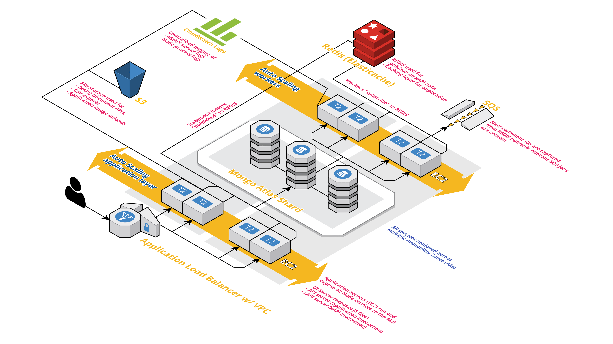

# Terraform Learning Locker

- [Introduction](#introduction)
- [Architecture](#architecture)
- [Prerequisites](#prerequisites)
- [Deployment](#deployment)
- [Testing](#testing)

## Introduction

This repository outlines the poof of concept of deploying Learning Locker on Azure. In this repository terraform is used to orchestrate the deployment of the following resources:

- Azure Application Load Balancer
- Azure Compute (VMs)
- Azure Cache for Redis
- Azure Blob Storage
- A Bastion Host
- Application Insights

The project is part of an investigation by TEL into adding Learning Locker to their e-Learning for Health platform and more.

## Architecture

The proposed architecture is as follows, designed for AWS:



## Prerequisites

The current prerequisites are as follows.

- [Terraform](https://www.terraform.io/)
- [Terratest](https://github.com/gruntwork-io/terratest)

## Deployment

### Setting your subscription

You may need to switch subscription to do this you can do the following from the `az cli`

```console
az ad sp create-for-rbac --name ServicePrincipalName 
```

### Setting up an environment

In order to initialise terraform for the first time you will need to run

```console
$ terraform init
```

Then we'll want to use workspaces which allow the terraform commands to be run with different states, giving them some degree of isolation.

```console
$ terraform workspace create staging
```

You can create multiple workspaces with the same command and then select the workspace you wish to use

```console
$ terraform workspace select staging
```

It's best practice to plan what terraform will do to ensure there are no errors. It will output a list of everything that will change, be created or removed.

```console
$ terraform plan -var-file=workspace/staging.tfvars
```

We can then apply those changes

```console
$ terraform apply -var-file=workspace/staging.tfvars
```

## Testing

We are currently using the default in-build `terraform fmt` and `terraform validate` to test our configuration issues such as bad syntax or missing variables. We are also using terragrunt for our integration andunit tests. The documentation for this can be found [here](https://github.com/gruntwork-io/terratest).

You can run tests using the standard Go testing method with `go test` or follow the instructions below.
